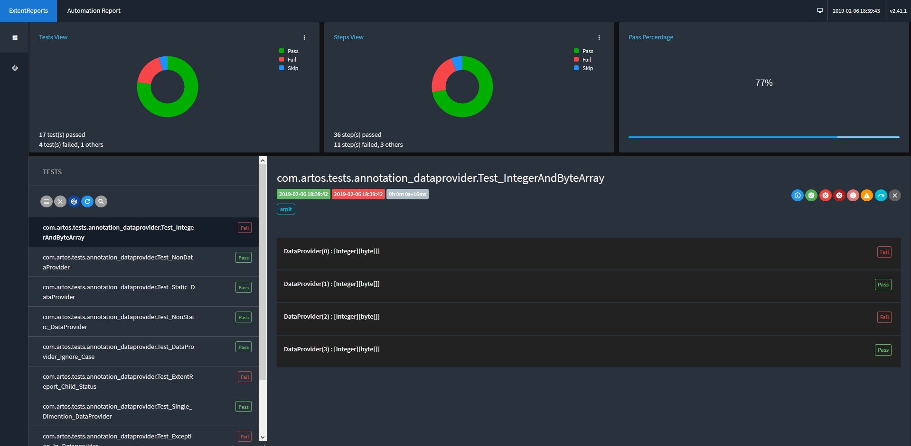

Extent Report
*************

* ARTOS by default generates professional looking Extent test report.
* Separate extent report is generate per test suite execution. 
* Extent reporting can be enabled/disabled via ``conf/framework_configuration.xml`` file.

.. important::

	* Extent report requires Internet access to get CSS information to display theme correctly. If Internet access is blocked or not available then extent report may look broken.

..