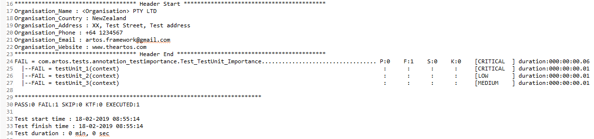

Importance Indicator
********************

In fast paced environment, debugging failed test-cases that are of high importance is crucial than spending time debugging test-cases that are of low importance. ARTOS **Importance Indicator** feature lets user specify importance of the test case using ```@TestImportance``` annotation. Specified importance level is reflected in the test reports and on the console during **Failure Highlights**. This allows test developer/lead/manager to judge seriousness of the failure quickly and they can take informed decision by just glancing over the failure report.

**Importance Indicator** can be defined at a test level or test unit level or both

.. code-block:: Java
	:linenos:
	:emphasize-lines: 2, 7, 15, 23
	:caption: : Sample test case and test unit with ***Importance Indicator***

	// This test case overall is of a CRITICAL importance
	@TestImportance(Importance.CRITICAL)
	@TestPlan(preparedBy = "Arpit", preparationDate = "18/02/2019", bdd = "GIVEN..WHEN..AND..THEN..")
	@TestCase
	public class Test_TestUnit_Importance implements TestExecutable {

		@TestImportance(Importance.CRITICAL)
		@Unit(sequence = 1)
		public void testUnit_1(TestContext context) {
			// -------------------------------------------------
			context.setTestStatus(TestStatus.FAIL, "This is a CRITICAL importance test unit");
			// -------------------------------------------------
		}
		
		@TestImportance(Importance.LOW)
		@Unit(sequence = 2)
		public void testUnit_2(TestContext context) {
			// -------------------------------------------------
			context.setTestStatus(TestStatus.FAIL, "This is a LOW importance test unit");
			// -------------------------------------------------
		}
		
		@TestImportance(Importance.MEDIUM)
		@Unit(sequence = 3)
		public void testUnit_3(TestContext context) {
			// -------------------------------------------------
			context.setTestStatus(TestStatus.FAIL, "This is a MEDIUM importance test unit");
			// -------------------------------------------------
		}

	}

}

..

Importance Indicator in console failure highlights
##################################################


Importance Indicator in summary report
######################################

