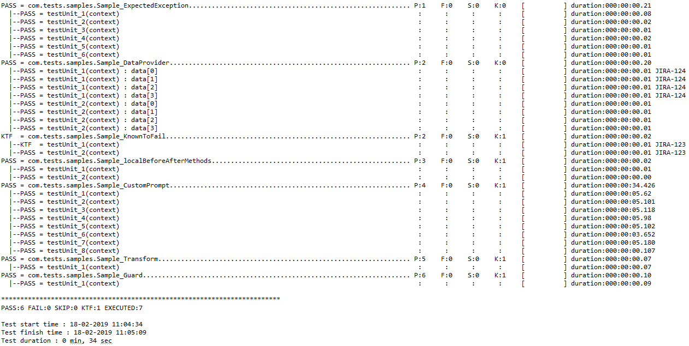

.. _Log4j_Pattern: https://logging.apache.org/log4j/2.x/manual/layouts.html

Logging Framework
*****************

Logs and reports are heart of any test framework. ARTOS includes Log4j based pre-configured and ready to use log framework.

Log files
#########

ARTOS by default generates two types of log files per test suite execution. 

* **General logs** : Test application logs will be recorded in a general log file. 

    * By default general logs do not include time-stamp or other log decoration, which makes it easy to read. 
    * Time-stamp and log decoration can be enabled using ``framework_configuration.xml`` file. 

* **Real-time logs** : In addition to general log file, ARTOS generates real time log file. Real time logs are produced by ARTOS' built in connectors or any class which implements ``Connectable`` interface. Real time logs includes time stamp and log decoration which may be useful in debugging. All data sent and received from built in connectors are logged in real time log file which provides following benefits:

   * Real time logs can be used to measure system performance by measuring time between the sent/receive events. Log parsing is easy with fixed format of the log file.
   * Real time logs are always recorded with time stamp, thread name, calling method name and other required information so test developers may choose to omit those information from general log and keep general logs noise free and human readable.Separate log file is generated to record sent and received events/data from classes that implements ``Connectable`` interface.

.. image:: Realtime_log.png

Test report
###########

ARTOS by default generates live text based report per test suite execution. Test report includes following information. Test report does not contain any business critical information so it can be shared to external parties.

* Test case fully qualified name and PASS/FAIL/SKIP/KTF summary
* PASS/FAIL/SKIP/KTF count
* Bug reference for failed test cases
* Test time duration with Millisecond accuracy
*

.. note:: 

    Test application and device under test may communicate using well defined protocols like Serial, RS485, TCP, UDP, TLS, USB, Protocol buffers etc.., Test application connector may queue incoming/outgoing events/data and application processes them one by one. Logging sent and received data live with time-stamp in separate log file (Realtime log file) keeps all the other noise away. Those logs can be later processed easily using Python script or similar. For all other debugging General logs can be used. 
..

Log File Path and Naming Convention
###################################

* Log files path := ``./reporting/subdirectory/``. Runner's package name is used as a sub-directory name to keep log files organized.
* General log filename := ``package name + "_" + suitename (optional) + "_" + threadnumber + "_" +  timestamp + "-all.log"``
* RealTime log filename := ``package name + "_" + suitename (optional) + "_" + threadnumber + "_" +  timestamp + "-realtime.log"``
* Summary report filename := ``package name + "_" + suitename (optional) + "_" + threadnumber + "_" +  timestamp + "-summary.log"``

Example:

| General log file : ``./reporting/com.test.feature1/com.test.feature1_suite1_0_1549353269885-all.log``
| Real time log file : ``./reporting/com.test.feature1/com.test.feature1_suite1_0_1549353269885-realtime.log``
| Summary report file : ``./reporting/com.test.feature1/com.test.feature1_suite1_0_1549353269885-summary.log``

Log Format
##########

* ARTOS supports text and HTML formatted logs.
* Text formatted log and report are enabled by default.
* Text and/or HTML logs can be enabled/disabled using ``framework_configuration.xml`` file. 

Log Pattern
###########

* General logs are not decorated by default to maintain simplicity.
* Log decoration can be enabled/disabled using ``framework_configuration.xml`` file.

    * Decoration disabled log pattern: ``"%msg%n%throwable"``
    * Decoration enabled log patter: ``"[%-5level][%d{yyyy-MM-dd_HH:mm:ss.SSS}][%t][%F][%M][%c{1}] - %msg%n%throwable"``
    * Refer: Log4j_Pattern_ for more information.

Log Rollover Policy
###################

    * Log rollover policy is triggered based on a file size of 20MB. 

Log Level
#########

Log level can be configured using ``conf/framework_configuration.xml`` file.

    * Following log levels are supported:

    .. csv-table:: 
        :header: Level, Description
        :widths: 12, 78
        :stub-columns: 0
            
        DEBUG, Designates fine-grained informational events that are most useful to debug an application.
        ERROR, Designates error events that might still allow the application to continue running.
        FATAL, Designates severe error events that will presumably lead the application to abort.
        INFO, Designates informational messages that highlight the progress of the application at coarse level.
        OFF, The highest possible rank and is intended to turn off logging.
        TRACE, Designates finer-grained informational events than the DEBUG.
        WARN, Designates potentially harmful situations.
    ..               
        
Runtime Log Enable/Disable
##########################

General log can be enabled/disabled at run time using following methods:

    * Disable log: ``context.getLogger().disableGeneralLog();``
    * Enable log: ``context.getLogger().enableGeneralLog();``

Log File Tracking
#################

All log files relevant to test suite are tracked and can be queried at runtime using following methods:

    * General log file list: ``context.getLogger().getCurrentGeneralLogFiles();``
    * Real-Time log file list: ``context.getLogger().getCurrentRealTimeLogFiles();``
    * Summary report file list: ``context.getLogger().getCurrentSummaryLogFiles();``

FAIL Stamp Injection
####################

**FAIL** Stamp is injected to log stream after test status is updated to FAIL. This allows user to know at which exact line the test unit failed during execution.

>>> Sample Stamp
**********************************
*********** FAIL HERE ************
**********************************

Parameterized logging
#####################

ARTOS supports parameterized logging. 

* Logging using string concatenation:

    ``context.getLogger().info("This is a test String" + "This is a test String 1");``
    ``context.getLogger().debug("This is a test String" + "This is a test String 2");``

* Logging using parameterized string:

    ``context.getLogger().info("This is a test String {} {}", "one", "two");``
    ``context.getLogger().debug("This is a test String {} {}", "one", "two");``

.. warning::

    Parameterized logging is less efficient compare to string concatenation, if test application does not use multiple log levels then it is recommended to avoid parameterized logging. Parameterized logging overall improves performance in case where test application utilities multiple log levels and user switches between log levels because system does not waste time in concatenating strings for logs which are disabled using log level configuration.

..