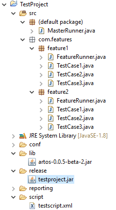

Use Command line Parameters
***************************

ARTOS support short and long convention of command line parameters. Supported commands are listed below:

.. csv-table:: 
	:header: Short, Long, Description
	:widths: 15, 15, 70
	:stub-columns: 0
	
	-c,--contributors, Prints ARTOS contributors name
	-h,--help, Command line help
	-p <arg>,--profile <arg>, Framework configuration profile name
	-t <arg>,--testscript <arg>, Test script file path
	-v,--version, ARTOS' version

..

Example 1: Run from compiled classes
####################################

::

	// long convention
	java -cp ".\lib\*;.\bin\" MasterRunner --testscript="testscript.xml" --profile="dev"

	// short convention
	java -cp ".\lib\*;.\bin\" MasterRunner -t="testscript.xml" -p="dev"

..

Example 2: Run from Jar
#######################

::

	// long convention
	java -jar .\lib\testproject.jar --testscript="testscript.xml" --profile="dev"

	// short convention
	java -jar .\lib\testproject.jar -t="testscript.xml" -p="dev"

..

Above examples are created using below project structure:
#########################################################

* Project compiled classes are located inside ``bin`` directory.
* Project dependency Jars are located inside ``lib`` directory.
* Project test script is located inside ``script`` directory.
* Project exported as JAR inside directory ``release``.
* Project jar name = ``testproject.jar``
* Project Master Runner class name = ``MasterRunner``.
* Project Test Script name = ``testscript.xml``.
* Project framework_config.xml profile = ``dev``.

>>> Project Jar manifest was created using following information:
Manifest-version: 1.0
Created-By: 1.0 (ARTOS Team)
Main-Class: MasterRunner
Class-Path: ../lib/artos-0.0.5-beta-2.jar