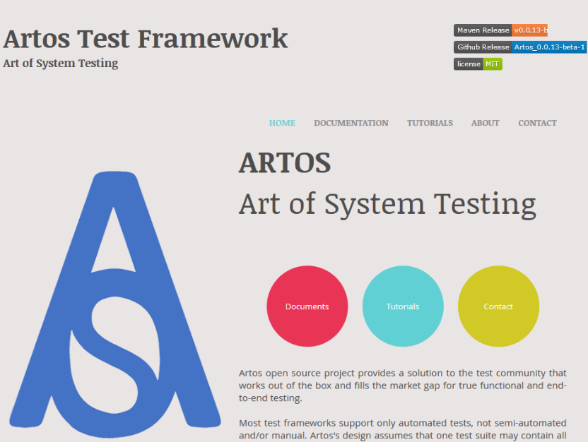

Visual Regression
*****************

A visual regression can be applied to front-end, user interface(UI) or embedded products with display rendering capability. A visual regression tool performs front-end, user interface(UI) or embedded product regression testing by capturing the screen-shots of web pages/UI/Frame Buffer and compare them with the gold sample images (either historical screen-shots or reference images that can be trusted). If a new image is not 100% match then visual regression tool can alert you and/or provide percentile of the match and/or return a result/diff image highlighting the areas where changes have been detected. User can use that information for record purpose so appropriate action can be triggered.

Many organization already use tools like Selenium, Cypress, WebdriverIO for an end to end testing, so image capturing capabilities are already inbuilt. In the context of embedded product testing, the product shall have an API that lets user capture a frame-buffer at run time. Once you have an image then only step required is to have a utility that compares images and provide diff between two images and percentage of mismatch.

Understanding the above requirements, Artos has taken a generic approach to cater to all kinds of testing. Artos provides inbuilt utilities which let you do the following. 

* Compare PNG or JPG images pixel by pixel and store result image to desired location.
* Request match percentage after image compare.
* Request result/diff image after image compare.
* Record images/snapshots to the Extent report.

Simple server
#############

Below code will start a server and will listen for incoming client.

.. code-block:: Java
	:linenos:
	:emphasize-lines: 0
	:caption: : Simple server example

	package com.tests.selenium;

	import java.io.File;
	import java.util.concurrent.TimeUnit;

	import org.openqa.selenium.OutputType;
	import org.openqa.selenium.TakesScreenshot;
	import org.openqa.selenium.WebDriver;
	import org.openqa.selenium.firefox.FirefoxDriver;

	import com.artos.annotation.*;
	import com.artos.framework.Enums.TestStatus;
	import com.artos.framework.infra.TestContext;
	import com.artos.interfaces.TestExecutable;
	import com.artos.utils.Guard;
	import com.artos.utils.ImageCompare;
	import com.artos.utils.UtilsFile;

	@TestPlan(preparedBy = "arpit", preparationDate = "25/08/2019", bdd = "GIVEN webpage is not modified since last regression then visual regression should pass")
	@TestCase
	public class Sample_Selenium implements TestExecutable {

	    @Unit
	    public void testUnit_1(TestContext context) throws Exception {
	        // -----------------------------------------------------
	        WebDriver fireFoxDriver = (WebDriver) context.getGlobalObject("FIREFOX_DRIVER");
	        fireFoxDriver.navigate().to("https://www.theartos.com");
	        Thread.sleep(8000);

	        // Take snapshot using Selenium
	        String relativePathToImage = "./reporting/testImage.png";
	        File destFile = takeSnapShot(fireFoxDriver, relativePathToImage);

	        // Store snapshot to the report file
	        context.setTestStatus(TestStatus.PASS, destFile, "Managed to display page successfully");

	        File goldSample = new File("./goldsamples/test.png");
	        ImageCompare ic = new ImageCompare();
	        ic.compare(goldSample, destFile, new File("./reporting"), "Result_Image");
	        File resultFile = ic.getResultImage();

	        // Store result image to report
	        context.setTestStatus(TestStatus.PASS, resultFile, "Result Image is stored for user reference");
	        // if image match is not 100% then throw an exception
	        Guard.guardEquals(100, ic.getPercentageMatch());
	        // -----------------------------------------------------
	    }

	    @BeforeTestUnit
	    public void beforeTest(TestContext context) {
	        System.setProperty("webdriver.gecko.driver", "./assets/driver/geckodriver_64bit.exe");
	        WebDriver firefoxDriver = new FirefoxDriver();
	        firefoxDriver.manage().timeouts().implicitlyWait(20, TimeUnit.SECONDS);
	        context.setGlobalObject("FIREFOX_DRIVER", firefoxDriver);
	    }

	    @AfterTestUnit
	    public void tearDown(TestContext context) {
	        WebDriver fireFoxDriver = (WebDriver) context.getGlobalObject("FIREFOX_DRIVER");
	        fireFoxDriver.quit();

	    }

	    public static File takeSnapShot(WebDriver webdriver, String fileWithPath) throws Exception {

	        // Convert web driver object to TakeScreenshot
	        TakesScreenshot scrShot = ((TakesScreenshot) webdriver);

	        // Call getScreenshotAs method to create image file
	        File srcFile = scrShot.getScreenshotAs(OutputType.FILE);

	        // Move image file to new destination
	        File destFile = new File(fileWithPath);

	        // Copy file at destination
	        UtilsFile.copyFile(srcFile, destFile, true);

	        return destFile;
	    }

	}

..

Original Image capture
######################

Modified Image capture
######################

Diff => Original and Modified Images
####################################

