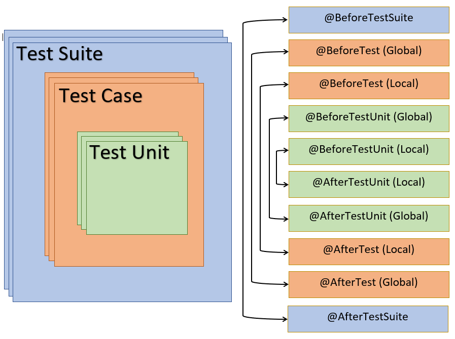

@BeforeTestUnit @AfterTestUnit
******************************

@BeforeTestUnit
###############

Method marked with annotation ``@BeforeTestUnit`` is executed in different order depending on where it is implemented. All possible combinations are listed below:

.. csv-table:: 
	:header: Implementation, Execution sequence
	:widths: 40, 70
	:stub-columns: 0

	**Inside a Runner**, Invoked before each test units **within a test suite**.
	**Inside a Test-Case**, Invoked before each test units **within a test case**.
	**Inside a Runner and a Test-Case**, Method implemented within the Runner class is invoked before each test units **within a test suite** and the method implemented in the test case will be invoked before each test units **within a test case**. Method implemented in the Runner class will execute before method implemented in the test case. 

..

@AfterTestUnit
##############

Method marked with annotation ``@AfterTestUnit`` is executed in different order depending on where it is implemented. All possible combinations are listed below:

.. csv-table:: 
	:header: Implementation, Execution sequence
	:widths: 40, 70
	:stub-columns: 0

	**Inside a Runner**, Invoked after each test units **within a test suite**.
	**Inside a Test-Case**, Invoked after each test units **within a test case**.
	**Inside a Runner and a Test-Case**, Method implemented within the Runner class is invoked after each test units **within a test suite** and the method implemented in the test case will be invoked after each test units **within a test case**. Method implemented in the Runner class will execute after method implemented in the test case. 

..