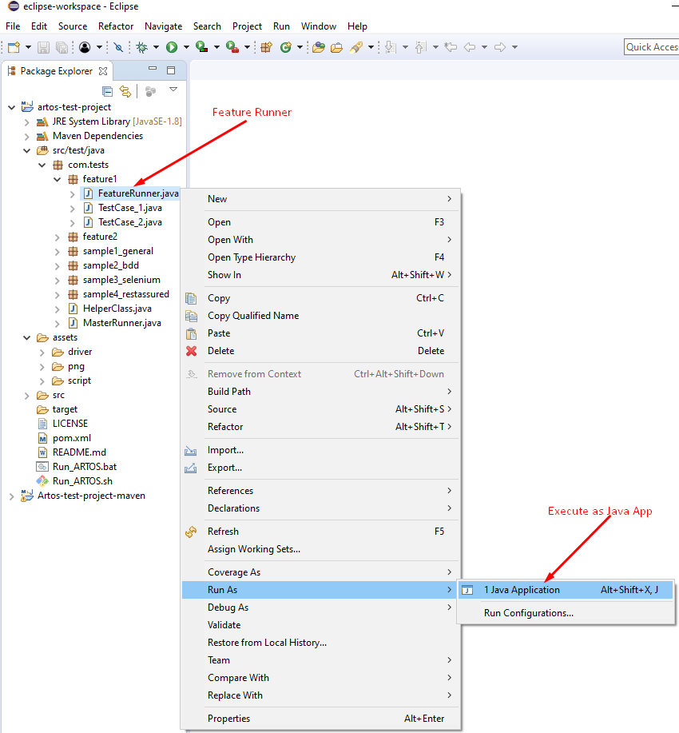
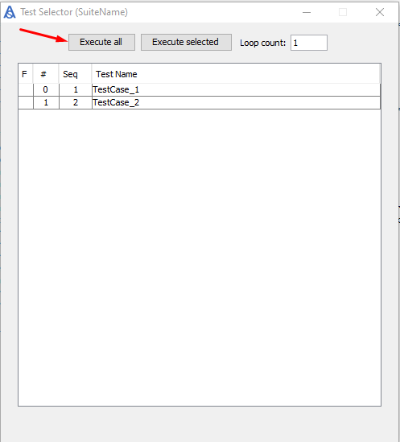

.. _Artos_Sample_Project: https://www.theartos.com/documentation

Get Started with Sample Project
*******************************

.. admonition:: Note
    
    Below guide is written using Eclipse IDE.

..

* Download sample project from Artos_Sample_Project_.
* Unzip the project to a local directory.
* Open Eclipse IDE. 
* Click on **File => Import..**

* Select **Existing Maven Projects** and click on **Next** button.

* Browse to Artos-test-project directory, select the directory and click **OK** button.

* Ensure pom.xml tick box is checked as shown below. Click on **Finish** button.

* Project will appear as shown below

* Select Feature Runner as shown below and execute as the Java application. 

* GUI Selector will appear on the screen. Click on **Execute All**.

* Logs and summary will be printed on a console.

Congratulation. You have successfully run your very first Artos test suite.

* Select Artos-Test-Project, use mouse right-click and select refresh.

* New directories will appear. Those directories contain logs, reports, Artos' configurations, auto-generated test script, and Artos templates to speed up test case writing.

.. admonition:: Recommended
    
    * Explore Artos' directories to gain more understanding about Artos. 
    * Execute and explore other Runners and example codes that are designed to help user get started with Artos. 
    * Ask us questions on Stack Overflow with [ARTOS] tag or email Artos team for any support queries.

..