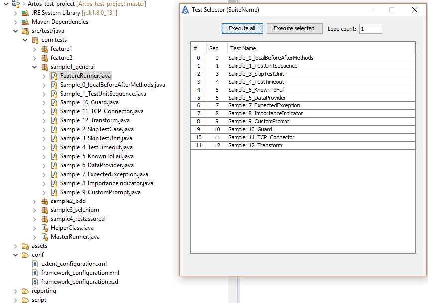

Execute Test Cases
******************

Upon a project launch Artos performs scan to find test cases within a runner's scan scope. Test cases are processed in the following order. 

	* Test cases with **skip=true** attribute are dropped from the list.
	* Test cases are dropped from the list, in case if they are not listed in user provided test list (list is provided via test script or test runner)
	* Test cases are dropped if they do not belong to desired test case groups. (Groups are provided via test script or test runner)
	* Remaining test cases are sorted in the sequence of provided test list (list is provided via test script or test runner). If test list is not provided then test cases are sorted using sequence declared using **sequence** attribute of @TestCase.

All sorted test cases are displayed to user using GUI test selector. Using GUI test selector user may do following

	* User may choose to execute selected or all test cases
	* User may change loop count
	* User may cancel the test suite execution.

Once execution is started GUI selector will be hidden.

.. important::

	* If only one test case is present then GUI test selector will not appear and test execution will be initiates automatically.
	* User can disable GUI test selector by changing **framework_configuration.xml** settings to **<property name="enableGUITestSelector">false</property>**.

..