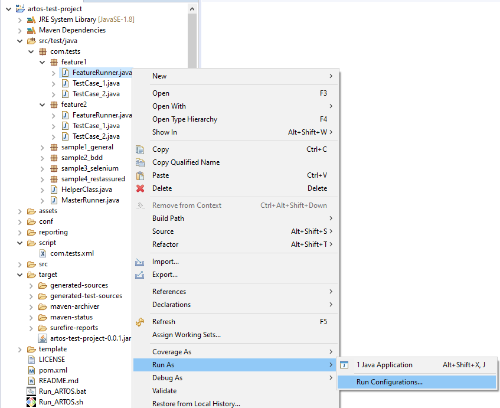
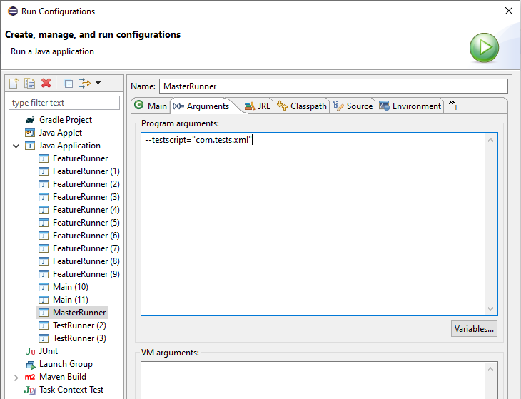

Launch test suite with test-script
**********************************

Artos test project can be executed in multiple different ways

* Launch project jar using command-line
* Launch Maven project via command-line
* Launch Runner via IDE (Eclipse, IntelliJ etc..)

Launch project jar (Windows command-line)
#########################################

* Step 1: Note down Runners fully qualified class-path (Example: ``com.tests.feature1.FeatureRunner``)
* Step 2: Build Artos test project jar (Example: ``artos-test-project-0.0.1.jar``)
* Step 3: Create a directory called ``lib`` at the location where ``artos-test-project-0.0.1.jar`` is situated.
* Step 4: Copy artos jar downloaded from maven repository inside ``lib`` directory.
* Step 5: Create a directory called ``conf`` at the location where ``artos-test-project-0.0.1.jar`` is situated. 
* Step 6: Copy artos configuration to ``conf`` directory.
* Step 7: Create a directory called ``script`` at the location where ``artos-test-project-0.0.1.jar`` is situated.
* Step 8: Copy XML based test script inside the ``script`` directory.

.. image:: Non-Maven_Project_Structure.png

* Step 9: Open command line prompt or PowerShell.
* Step 10: change directory location to the same directory where artos-test-project-0.0.1.jar is present using ``cd`` command.
* Step 11: Execute below command line argument to execute the Artos test project.

.. code-block:: Text
    :linenos:
    :emphasize-lines: 0
    :caption: Example: Command line to launch test project jar
        
    java -cp "artos-test-project-0.0.1.jar;.\lib\artos-0.0.12.jar" com.tests.feature1.FeatureRunner --testscript="com.tests.xml" --profile="dev"

..

.. admonition:: Important

    * By default ``dev`` profiled configuration is used from framework_configuration.xml file.
    * If a user has separate configurations for ``dev`` and ``production`` environment OR ``Window`` and ``Linux`` environments then they should pass appropriate profile name via command-line arguments.  

..

Launch Maven project as unit test framework
###########################################

.. admonition:: Note

	Artos sample project can be downloaded from Artos website. 

..

Below example explains how to launch Artos Maven test project in both the environments (Windows or Linux). Artos sample project POM file is pre-configured to launch Artos test project at compile time like a unit test framework:

* ``exec-maven-plugin`` is used to execute ``Run_ARTOS.bat`` for Windows and ``Run_ARTOS.sh`` for Linux. 
* ``exec-maven-plugin`` is configured to execute script at unit level by setting ``<phase>test</phase>``.
* ``<profiles></profiles>`` feature is used to select correct extension of the files based on platform.

**Run_ARTOS.bat** and **Run_ARTOS.sh** script content is specified below.

    .. code-block:: Text
        :linenos:
        :emphasize-lines: 0
        :caption: Run_ARTOS.bat content
            
        @echo off
        set mypath=%cd%
        @echo %mypath%
        mvn exec:java -D"exec.mainClass"="com.tests.FeatureRunner" -Dexec.args="-v -p=dev -t=testscript.xml"
        pause

    .. 

    .. code-block:: Text
        :linenos:
        :emphasize-lines: 0
        :caption: Run_ARTOS.sh content
            
        #!/bin/sh
        #echo off
        mvn exec:java -Dexec.mainClass="com.tests.FeatureRunner" -Dexec.args="-v -p=dev -t=testscript.xml"

    ..

Runner launch using test script (Eclipse IDE)
#############################################

* Right-click on Runner. Go to **Run As => Run Configurations...**

* Provide test script argument as shown below and click on run button

