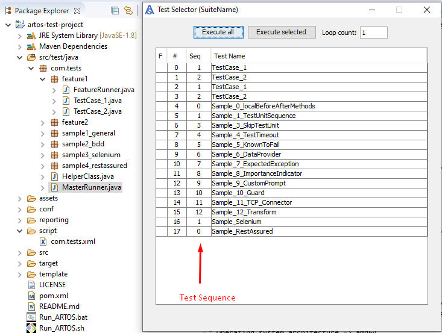

Test Sequence
*************

Artos is designed to support unit, functional and end-to-end automated/manual testing thus test sequence is not a mandatory requirement. If test cases are independent of each other and test execution order is not important then the test sequence assignment can be ignored.

Sequence benefits
=================

* Brings consistency to test execution so the bug can easily be reproduced.
* Brings consistency into log parsing if that is a requirement.
* If test cases or test units are dependent on each other then sequence can be used to describe test dependency or execution order.

Ordering process
================

* Within Runner's scan scope => packages are sorted by name.
* Within each package => test cases are sorted by given sequence number.
* Within each test case => test units are sorted by given sequence number.

.. code-block:: Java
    :linenos:
    :emphasize-lines: 10, 13, 20, 27
    :caption: Example: Test case and unit sequence
    
    package com.tests.feature1;

    import com.artos.annotation.TestCase;
    import com.artos.annotation.TestPlan;
    import com.artos.annotation.Unit;
    import com.artos.framework.infra.TestContext;
    import com.artos.interfaces.TestExecutable;

    @TestPlan(preparedBy = "User1", preparationDate = "19/02/2019", bdd = "GIVEN..WHEN..AND..THEN..")
    @TestCase(sequence = 1)
    public class TestCase_1 implements TestExecutable {

        @Unit(sequence = 1)
        public void testUnit_1(TestContext context) {
            // --------------------------------------------------------------------------------------------
            context.getLogger().info("First Unit");
            // --------------------------------------------------------------------------------------------
        }

        @Unit(sequence = 2)
        public void testUnit_2(TestContext context) {
            // --------------------------------------------------------------------------------------------
            context.getLogger().info("Second Unit");
            // --------------------------------------------------------------------------------------------
        }
        
        @Unit(sequence = 3)
        public void testUnit_3(TestContext context) {
            // --------------------------------------------------------------------------------------------
            context.getLogger().info("Third Unit");
            // --------------------------------------------------------------------------------------------
        }

    }

..

Assigned test case sequence can be reviewed via GUI test selector

Ignoring sequence assignment
============================

* If sequence numbers are not assigned to some or all test cases/units then those test cases/units execution order can not be guaranteed, all though those test cases/units will retain their positions respective to other test cases/units sequence numbers within execution order. 

Test sequence override via test script
======================================

* A test script can override test sequence by specifying fully qualified test class paths within a test script.
* Test units sequence can not be overridden from the test script.

.. code-block:: xml
    :linenos:
    :emphasize-lines: 5,6,7,8
    :caption: Example: Test script overrides test sequence if test cases are specified
    
    <?xml version="1.0" encoding="UTF-8" standalone="no"?>
    <configuration version="1">
      <suite enable="true" loopcount="1" name="UniqueName">
        <tests>
          <test name="com.tests.feature1.TestCase_1"/>
          <test name="com.tests.feature1.TestCase_2"/>
          <test name="com.tests.feature2.TestCase_1"/>
          <test name="com.tests.feature2.TestCase_2"/>
        </tests>
        <featurefiles>
        </featurefiles>
        <parameters>
          <parameter name="PARAMETER_0">parameterValue_0</parameter>
          <parameter name="PARAMETER_1">parameterValue_1</parameter>
          <parameter name="PARAMETER_2">parameterValue_2</parameter>
        </parameters>
        <testcasegroups>
          <group name="*"/>
        </testcasegroups>
        <testunitgroups>
          <group name="*"/>
        </testunitgroups>
      </suite>
    </configuration>

..

.. code-block:: xml
    :linenos:
    :emphasize-lines: 4,5
    :caption: Example: Test script sequence override is disabled if test cases are not specified
    
    <?xml version="1.0" encoding="UTF-8" standalone="no"?>
    <configuration version="1">
      <suite enable="true" loopcount="1" name="UniqueName">
        <tests>
        </tests>
        <featurefiles>
        </featurefiles>
        <parameters>
          <parameter name="PARAMETER_0">parameterValue_0</parameter>
          <parameter name="PARAMETER_1">parameterValue_1</parameter>
          <parameter name="PARAMETER_2">parameterValue_2</parameter>
        </parameters>
        <testcasegroups>
          <group name="*"/>
        </testcasegroups>
        <testunitgroups>
          <group name="*"/>
        </testunitgroups>
      </suite>
    </configuration>

..

Test sequence override via Runner
=================================

* A Runner can override test sequence by specifying test sequence within the Runner.
* Test unit sequence can not be overridden from the Runner.

.. code-block:: Java
    :linenos:
    :emphasize-lines: 14,15,16,17
    :caption: Example: Runner overrides test case sequence if test list is passed as shown below.
    
    package com.tests;

    import java.util.ArrayList;
    import com.artos.framework.infra.Runner;
    import com.artos.interfaces.TestExecutable;

    public class MasterRunner {

        public static ArrayList<TestExecutable> getTestList() throws Exception {
            ArrayList<TestExecutable> tests = new ArrayList<TestExecutable>();

            // --------------------------------------------------------------------------------------------
            // TODO User May Add Test Case Manually as show in sample below
            tests.add(new com.tests.feature1.TestCase_1());
            tests.add(new com.tests.feature1.TestCase_2());
            tests.add(new com.tests.feature2.TestCase_1());
            tests.add(new com.tests.feature2.TestCase_2());
            // --------------------------------------------------------------------------------------------

            return tests;
        }

        public static void main(String[] args) throws Exception {
            Runner runner = new Runner(MasterRunner.class);
            runner.setTestList(getTestList());
            runner.run(args);
        }
    }

..

.. code-block:: Java
    :linenos:
    :emphasize-lines: 10
    :caption: Example: Runner test case sequence overrides is disabled if empty test list or null is passed.
    
    package com.tests;

    import com.artos.framework.infra.Runner;
    import com.artos.interfaces.TestExecutable;

    public class MasterRunner {

        public static void main(String[] args) throws Exception {
            Runner runner = new Runner(MasterRunner.class);
            runner.setTestList(null);
            runner.run(args);
        }
    }

..

Override priority
=================

* If test script is used and override sequence is specified then Runner override sequence is ignored. 
* If test script is not used then Runner override sequence is used.
* If test script is not used and Runner override is disabled then sequence specified within ``@TestCase`` annotation is used to execute test cases. 

.. admonition:: Important

    * Test cases will be ignored if they are not specified in the override script.
    * Console warnings will be printed in case override sequence specifies test cases that are outside Runner's scan scope. In given situation test execution will be continued by ignoring out of scope test cases. 

..