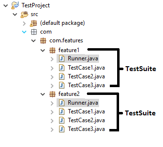
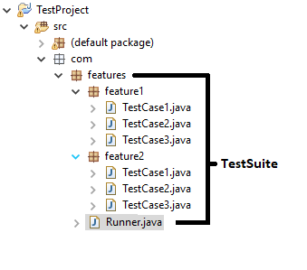

Implement Project
*****************

Recommended Project Structures
##############################

Feature Structure
=======================

* Packages are organized based on features.
* Each package acts as a test suite.

Super Structure
===============

* Packages are organized based on features or a test group.
* Entire project acts as a single test suite.
* Project contains single runner which is in parent position to all other packages.
* Test runner will see test classes within same package and child packages.

Tree Structure (Feature Tree)
=============================

This structure is a mixture of the above structures.

* Packages are organized based on features or a test group.
* Projects can be executed as single or multiple test suites.
* Project contains at least one runner in parent position and one runner within each feature package.
* Depending on the runner used, the project may see limited or all test cases within the project.

