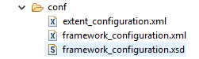

Generate Default Configurations
*******************************

The ARTOS' generates required configuration files and directories upon launch if not present. Configuration files are generated in ``conf`` directory. If configuration files are already present then it will not be overwritten.

.. csv-table:: 
	:header: Configuration Name, Description
	:widths: 30, 70
	:stub-columns: 0
	
	"conf/extent_configuration.xml", "configuration for extend reports"
	"conf/framework_configuration.xml", "configuration for ARTOS framework"
	"conf/framework_configuration.xsd", "XML schema definition for framework_configuration.xml"

..