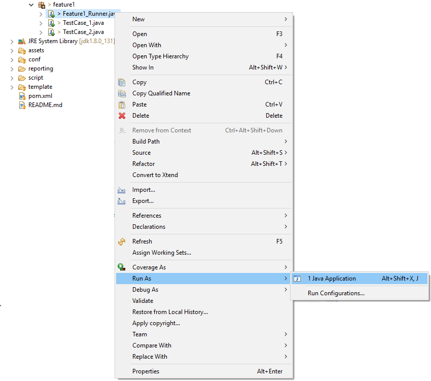

Running Artos
*************

Artos can be run via

* Command line
* IDE (Example : Eclipse, IntelliJ etc..)

Command line
############

.. code-block:: Text
	:linenos:
	:emphasize-lines: 8

	// Current example is written with following assumption: 
	// * Test project only has artos-0.0.1.jar and testproject.jar as a dependency. 
	// * artos-0.0.1.jar is located at .\lib\artos-0.0.1.jar.
	// * Test script is located at .\script\testscript.xml.
	// * Class with main method name is TestRunner.java (Test runner).
	// * "dev" profile is used from framework_configuration.xml. 
	
	java -cp .\lib\artos-0.0.1.jar .\lib\testproject.jar TestRunner --testscript=".\script\testscript.xml" --profile="dev"

.. 

Eclipse IDE
###########

* Right click on the test runner class.
* Select options Run as => Java Application .

