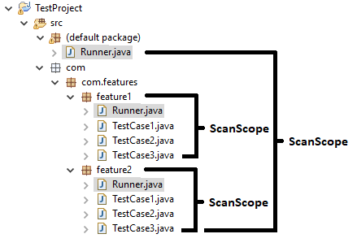
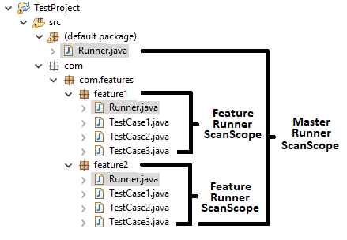
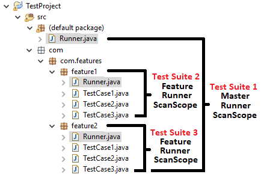

Test Suite & Test Runner
************************

Scan Scope
##########

A section of the Java project that will be scanned during the search of test cases is called a scan scope. ARTOS runner scans a section of Java project as an initial step of test suite execution. A class which initiates this scan is called the **Runner**. The Runner only scans withing same package or its child packages. Scanned section is considered as **Scan Scope** of the Runner.  

The Runner
##########

* A Runner is the ``public`` class which is an entry point to a test suite. 
* A Runner class contains the ``main()`` method.
* A Runner performs a scan within its scan scope in search of test cases (Classes annotated with ``@TestCase`` annotation).
* A Runner at project root location [1]_ is called a **Master Runner** which has visibility of all test cases within a project.
* A Runner created within individual package is called a **Feature Runner** which has visibility inside its own package or its sub-packages.
* A test project can have more than one Runner.

.. [1] Project Root location

* Non-Maven project root location => ``src``.
* Maven project root location => ``src/main/java``.
* In Eclipse IDE root location is also known as "default package".

Test Suite
##########

* A Runner and test cases within Runner's scan scope combined consists a **Test Suite**.
* A project contains as many test suites as number of test Runners.
* A test suite can not execute test cases outside its Runner's scan scope
* Test suites may share one or more test cases.

